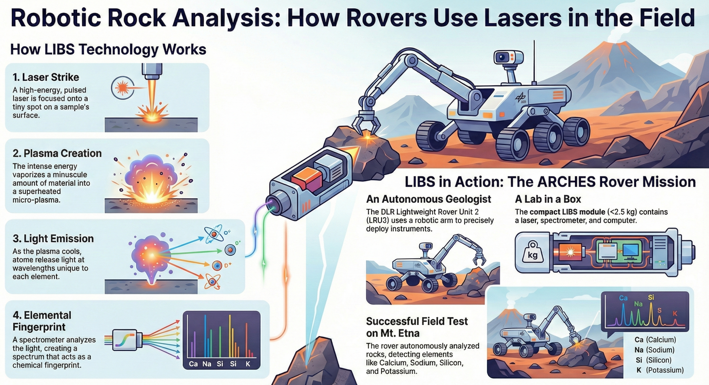
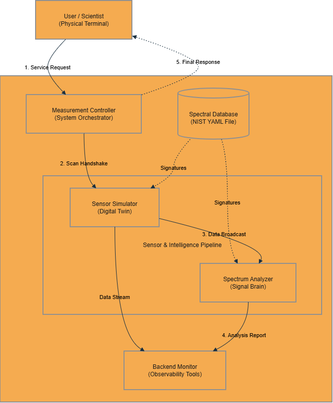
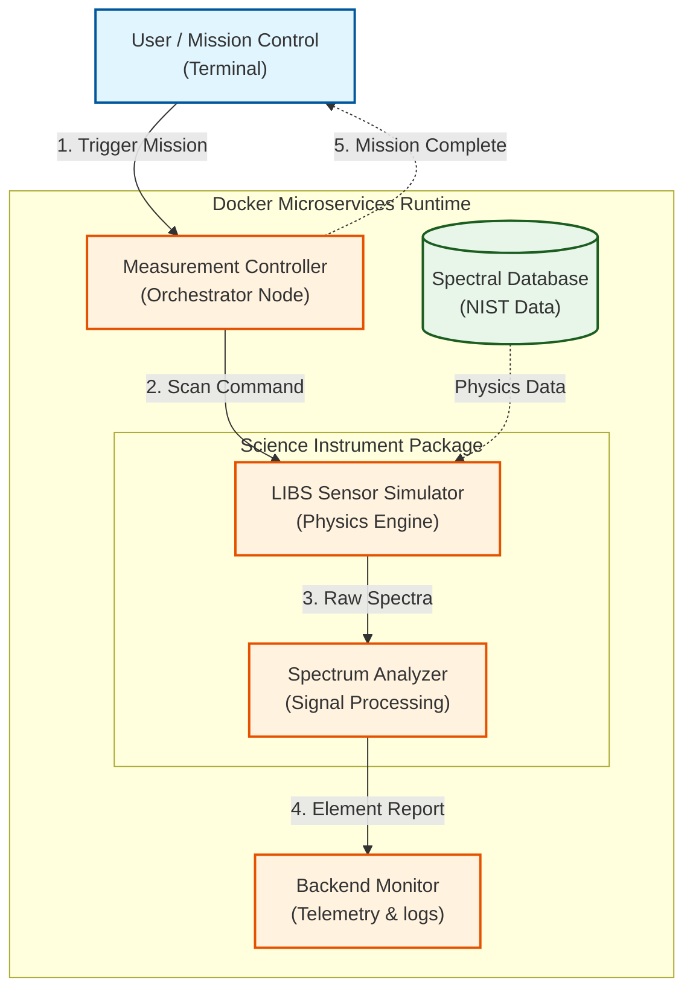
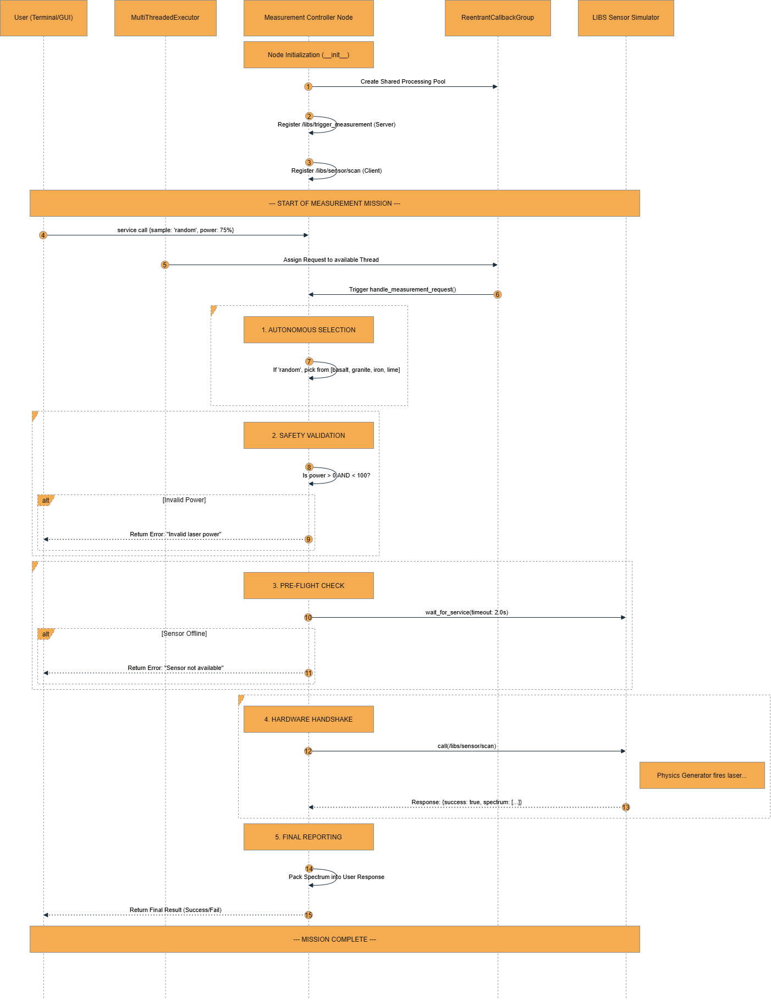
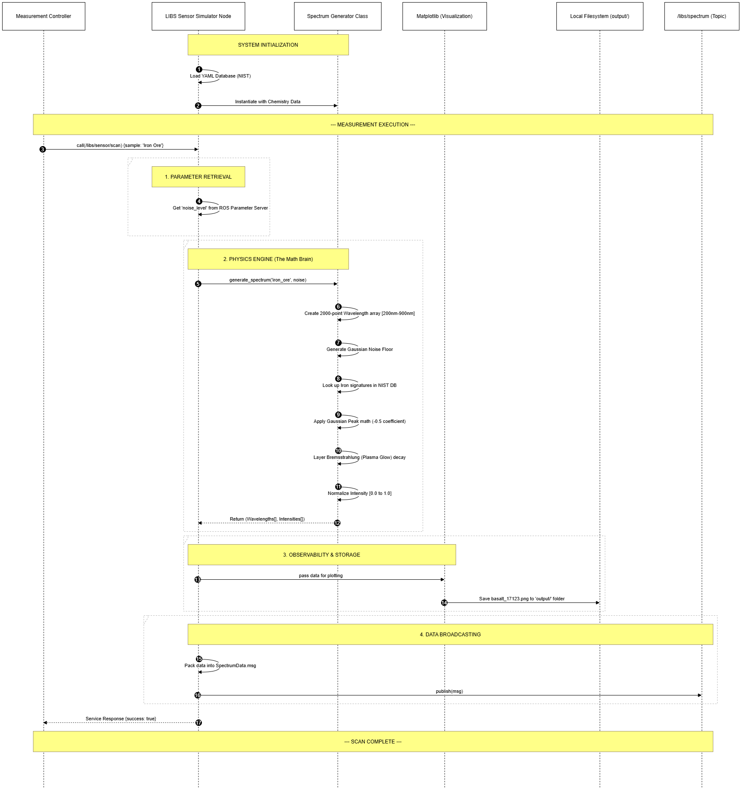
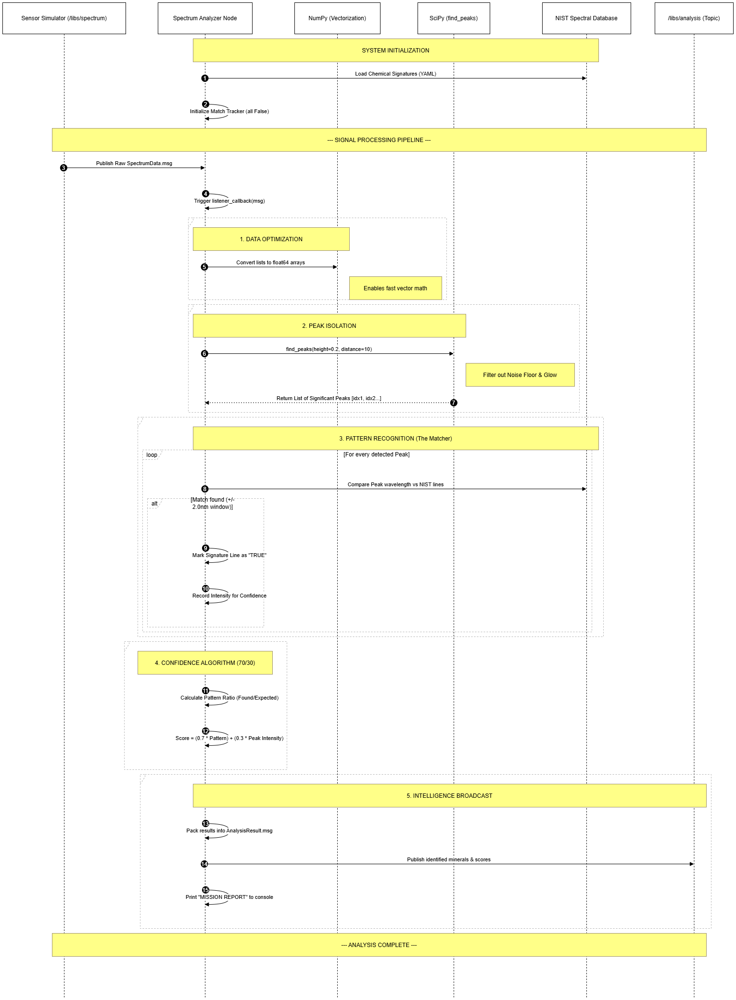

# 🌌 Scout Rover Digital Twin: ROS 2-Based Autonomous Exploration System

[](https://docs.ros.org/en/humble/index.html)
[](http://gazebosim.org/)
[](https://www.docker.com/)
[](https://www.python.org/)
[](LICENSE)

> **A high-fidelity Digital Twin of the NASA Curiosity Rover, engineered for autonomous scientific exploration and simulated Laser-Induced Breakdown Spectroscopy (LIBS) analysis on Mars.**



---

## ℹ️ About The Project

This project simulates the complete lifecycle of a Martian rock analysis mission, extending beyond standard navigation simulations to include **realistic scientific instrument modeling**. It serves as a testbed for developing autonomous decision-making algorithms for planetary exploration.

### 🌟 Key Innovations
*   **Physics-Accurate Simulation**: Architected a **ROS 2 Humble** and **Gazebo-based** simulation, implementing custom nodes and plugins for autonomous navigation and sensor data acquisition.
*   **Microservices Architecture**: Designed a **Dockerized Microservices Architecture** orchestrating **Python** and **C++** modules for real-time spectral analysis and chemometric processing.
*   **Advanced Sensing**: Developed a **Laser Spectroscopy (LIBS)** simulation pipeline using Ray Sensors and Computer Vision algorithms for automated target detection and classification.
*   **Robust IPC**: Implemented Inter-Process Communication (IPC) via **ROS 2 topics and services** to synchronize rover telemetry, science instrument controls, and physics-based environment interactions.

---

## 🏗️ System Architecture

The system follows a **Modular, Decoupled Architecture**, ensuring that every component is isolated and communicates over a standard ROS 2 network. This design mimics the rigorous software standards of flight software.

### Main Architecture Diagram




---

## 🧠 Software Components Deep Dive

### 1. Measurement Controller (The "Brain")
Orchestrates the scientific workflow. It handles user requests, manages the state machine, and coordinates the sensor and analyzer nodes to prevent deadlocks.


### 2. LIBS Sensor Simulator (The "Physics Engine")
Simulates the physical interaction of a high-energy laser with Martian rock samples. It generates realistic spectral data based on NIST atomic emission lines, adding Gaussian noise to mimic real-world sensor imperfections.


### 3. Spectrum Analyzer (The "Chemist")
Processes the raw spectral data using advanced signal processing algorithms (peak detection, background subtraction) to identify chemical elements (e.g., Fe, Si, Al) with high confidence.


---

## 🛠️ Installation & Usage

### Prerequisites
*   [Docker](https://docs.docker.com/get-docker/) installed.
*   No ROS 2 installation required on host (everything runs in container).

### Quick Start
1.  **Launch the System**:
    ```bash
    docker compose up --build
    ```

2.  **Monitor Telemetry**:
    Open a new terminal to view the live backend logs:
    ```bash
    docker exec -it libs_rover_ros2 bash -c "source /ros2_ws/install/setup.bash && ros2 run libs_rover_pkg backend_monitor_node.py"
    ```

3.  **Execute a Science Mission**:
    Trigger a remote LIBS analysis on a target rock:
    ```bash
    docker exec -it libs_rover_ros2 bash -c "source /ros2_ws/install/setup.bash && ros2 service call /libs/trigger_measurement libs_rover_pkg/srv/TriggerMeasurement \"{sample_type: 'basalt', laser_power_percent: 100.0}\""
    ```

---

## 📂 Project Structure

```bash
libs_rover_ws/
├── src/
│   └── libs_rover/
│       ├── msg/             # Custom ROS 2 Interfaces (SpectralData.msg)
│       ├── srv/             # Service Definitions (TriggerMeasurement.srv)
│       ├── urdf/            # Curiosity Rover Digital Twin Model (XACRO)
│       ├── launch/          # Gazebo & Node Orchestration
│       └── libs_rover/      # Python Nodes (Controller, Simulator, Analyzer)
├── Architecture_diagrams/   # Visual Documentation Assets
├── Dockerfile               # Reproducible Environment Definition
└── docker-compose.yml       # Container Orchestration
```

---

## 🎓 core Technologies

*   **Middleware**: ROS 2 Humble (DDS)
*   **Simulation**: Gazebo 11 (Physics & Rendering)
*   **Containerization**: Docker & Docker Compose
*   **Languages**: Python 3.10, XML (URDF/XACRO), CMake
*   **Libraries**: NumPy, SciPy, RCLPY

---

*Developed as a high-fidelity prototype for autonomous planetary exploration systems.*
